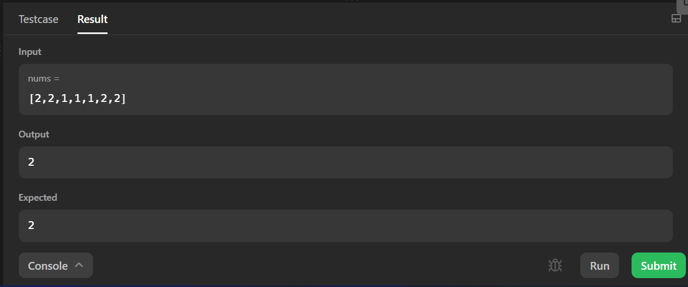

<h2><a href="https://leetcode.com/problems/majority-element/">Majority Element</a></h2><h3>Easy</h3><hr>
<div>
<p>Given an array <code>nums</code> of size <code>n</code>, return the majority element.</p>

<p>The majority element is the element that appears more than <code>⌊n / 2⌋</code> times. You may assume that the majority element always exists in the array.</p>

<p>&nbsp;</p>
<p><strong class="example">Example 1:</strong></p>

<pre><strong>Input:</strong> nums = [3,2,3]
<strong>Output:</strong>3

</pre>

<p><strong class="example">Example 2:</strong></p>

<pre><strong>Input:</strong>  nums = [2,2,1,1,1,2,2]
<strong>Output:</strong> 2

</pre>

<p>&nbsp;</p>
<p><strong>Constraints:</strong></p>

<ul>
    <li><code>n == nums.length</code></li>
	<li><code>1 &lt;= n &lt;= 5*10<sup>4</sup></code></li>
	<li><code>-10<sup>9</sup> &lt;= nums[i] &lt;= 10<sup>9</sup></code></li>
</ul>
</div>

</div>
<h2>Approach</h2>
<p>&nbsp;</p>
<p><strong>Brute Force</strong></p>

```cpp
  
  int max = 0; // track the maximum occurence of element
  int ele = 0; // track the majority element
    for (int i = 0; i < nums.size(); i++) {
        int count = 0; // count the frequency of element
        for (int j = i; j < nums.size(); j++) {
			// increment the count if the element occurs more than once
            if (nums[i] == nums[j]) count += 1;
        }
        if (count > max) {
			// if count becomes greater than max then store the value of element and its frequency
            max = count;
            ele = nums[i];
        }
    }
	// if the max is greater than ⌊n / 2⌋ where n is size then return the element
    if (max > nums.size() / 2) return(ele); 
    return(-1);  

```
<p><strong>Time Complexity :</strong> O(n<sup>2</sup>)</p>
<p><strong>Space Complexity :</strong> O(1)</p>

<p>&nbsp;</p>
<p><strong>Moore's Voting Algorithm </strong></p>
<p><strong>Step 1 :</strong>Find the element having maximum frequency</p>
<ul>
	<li>Let's intialize variable <code>index=0</code>,<code>i</code> and <code>count=1</code></li>
	<li>Traverse through the array using for loop intialize <code>i=1</code></li>
	<li>Initially we already count the first element in array. So we traverse from second element</li>
	<li><code>index</code> will track the index of candidate element in array</li>
	<li>if the current element is the same as the candidate element then increment the <code>count</code></li>
	<li>else decrement the <code>count</code></li>
	<li>if <code>count==0</code> then update <code>index=i</code> and <code>count=1</code></li>

</ul>
<p><strong>Step 2 :</strong>Check if the candidate element that is element at <code>index</code> is majority element</p>
<ul>
	<li>if the candidate element's count is greater than <code>N/2</code> where N is size of array then it is a majority element</li>
	<li>intialize <code>c=0</code> and increment c if the candidate element found</li>
	<li>if <code>c>N/2</code> then return candidate element</li>
</ul>

<p><strong>Time Complexity :</strong> O(n)</p>
<p><strong>Space Complexity :</strong> O(1)</p>


</div>

## Screenshots

